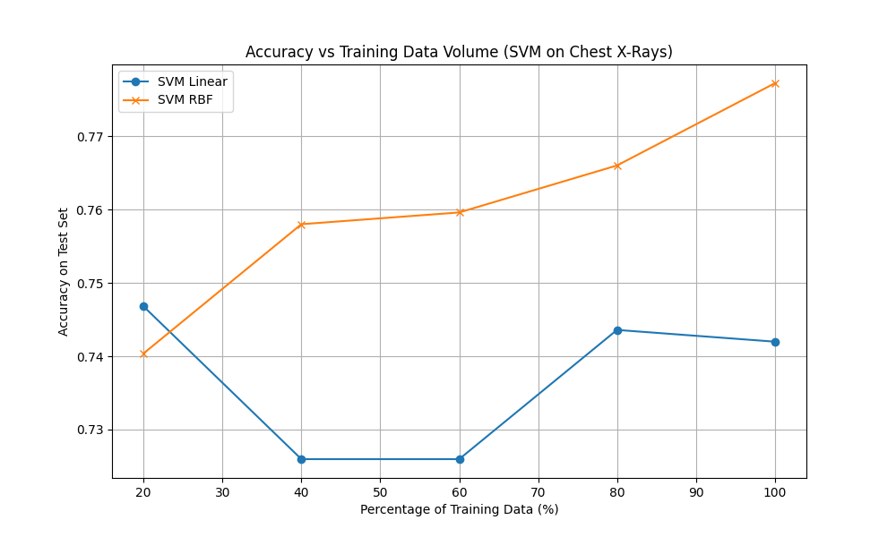
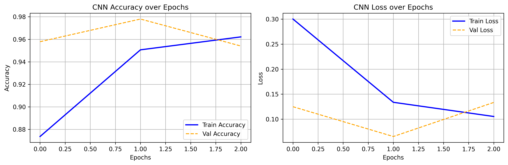

# Medical Image Classification and Deep Learning Diagnostics

### Core Project Idea
This study evaluates the continuity and transition from classical Machine Learning to Deep Neural Networks within medical imaging
The research begins by benchmarking Support Vector Machines using Radial and Linear Kernels
It then directly contrasts these mathematical hyperplanes against Convolutional Neural Networks under data starvation constraints
The ultimate phase explores cross domain Transfer Learning by migrating learned Lung imaging geometric features directly to Brain Tumor classification

### Dataset Resource
Chest X-Ray Pneumonia Neural Dataset
https://www.kaggle.com/datasets/paultimothymooney/chest-xray-pneumonia

### Methodology
Raw medical imagery ingested and normalized to uniform grayscale matrices
Radial and Linear Support Vector Machines constructed for baseline pattern recognition
Dual Conv2D Neural Networks built from scratch to replace classical limitations
Transfer Learning executed by freezing the Chest X-Ray vision layers and grafting dynamic Brain Tumor classification output heads

### Algorithmic Outcomes
Deep Convolutional grids drastically outperform classical SVM hyperplanes in complex biological imaging
Data Starvation modeling proves Linear SVMs plateau completely due to raw pixel variance
CNN architectures scale proportionally and infinitely as data density approaches full capacity
Pre trained Lung models successfully map Brain Tumors significantly faster than networks built with zero prior knowledge

### Diagnostic Graphs and Visual Data

Data Starvation Plot visualizing the performance divergence between classical Linear approaches and deep CNN scaling

Epoch Training Matrix revealing the rapid validation accuracy convergence of the primary diagnostic CNN

Transfer Learning overlay confirming frozen internal layers reduce computational overhead compared to blank architectures

*(Execute the final Jupyter Notebook cells to dynamically map these graphs into your output directory)*
