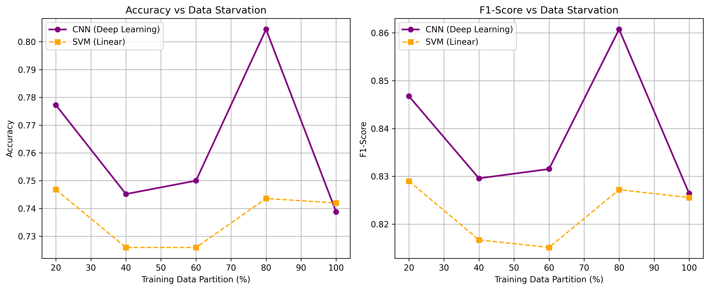
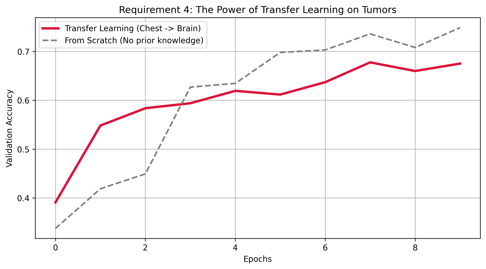

# Exercise 2 — SVM vs CNN on Chest X-Ray, with Transfer Learning to Brain Tumors

## What this is

This notebook benchmarks two classification approaches on a chest X-ray pneumonia dataset, then tests whether a CNN trained on chest images can carry useful knowledge over to a brain tumor dataset.

Three tasks in order:
1. PCA + SVM baseline (linear and RBF kernels)
2. Custom CNN trained from scratch on chest X-rays
3. Transfer learning — the chest CNN's convolutional layers are frozen and a new output head is trained on brain tumor images

---

## Dataset

**Chest X-Ray (Pneumonia)** — Kaggle  
https://www.kaggle.com/datasets/paultimothymooney/chest-xray-pneumonia

Train/test folders already split. Classes: `NORMAL` (0) and `PNEUMONIA` (1).

| Class | Training images |
|:---|:---|
| NORMAL | 1,341 |
| PNEUMONIA | 3,875 |

**Brain Tumor MRI** — stored locally in `brain_data/`  
Classes: Glioma (0), Meningioma (1), Pituitary (2), No Tumor (3)  
Split: `Training/` and `Testing/` folders used directly.

| Class | Training | Testing |
|:---|:---|:---|
| Glioma | 826 | 100 |
| Meningioma | 822 | 115 |
| Pituitary | 827 | 74 |
| No Tumor | 395 | 105 |

---

## Pipeline

**Images are loaded at 64×64 grayscale.** Flattened to 4,096 features for SVM, kept as 64×64×1 arrays for the CNN.

### PCA + SVM
- PCA reduces the 4,096 pixel features down to components that explain 95% of variance.
- Two SVM kernels are tested: Linear and RBF.
- 4 metrics reported: Accuracy, F1-Score, Sensitivity, Specificity.

| Kernel | Accuracy | F1 | Sensitivity | Specificity |
|:---|:---|:---|:---|:---|
| Linear | 74.20% | 0.826 | 0.977 | 0.350 |
| RBF | 77.72% | 0.847 | 0.987 | 0.427 |

Both kernels find pneumonia cases well (high sensitivity) but struggle to correctly identify normal lungs (low specificity). That's partly a class imbalance effect — pneumonia dominates the training set nearly 3:1.

---

### CNN (Chest X-Ray)
A small custom CNN: Conv2D(32) → MaxPool → Conv2D(64) → MaxPool → Flatten → Dense(64) → sigmoid output.

Trained for **3 epochs** (locked at 3 for CPU speed). Saved to `chest_xray_cnn.keras`.

| Metric | Value |
|:---|:---|
| Accuracy | 81.25% |
| F1 | 0.867 |
| Sensitivity | 0.974 |
| Specificity | 0.543 |

The CNN beats the SVM on every metric. Specificity improves the most — the CNN makes fewer false alarms on healthy patients.

Validation accuracy climbs fast in the first epoch and roughly tracks train accuracy. The 3-epoch limit keeps training short but the model still converges.

---

### Data Starvation (SVM vs CNN across training fractions)

Both models were trained on 20%, 40%, 60%, 80%, and 100% of the chest training data. The test set stays fixed.

| Fraction | SVM Acc | SVM F1 | SVM Sens | SVM Spec | CNN Acc | CNN F1 | CNN Sens | CNN Spec |
|:---|:---|:---|:---|:---|:---|:---|:---|:---|
| 20% | 74.68% | 0.829 | 0.982 | 0.355 | 77.72% | 0.847 | 0.985 | 0.432 |
| 40% | 72.60% | 0.817 | 0.977 | 0.308 | 74.52% | 0.830 | 0.992 | 0.333 |
| 60% | 72.60% | 0.815 | 0.967 | 0.325 | 75.00% | 0.832 | 0.987 | 0.355 |
| 80% | 74.36% | 0.827 | 0.982 | 0.346 | 80.45% | 0.861 | 0.967 | 0.534 |
| 100% | 74.20% | 0.826 | 0.977 | 0.350 | 73.88% | 0.826 | 0.995 | 0.312 |

SVM accuracy is almost flat across all fractions — it's not getting better with more data. The CNN is noisier (only 3 epochs per run), but at 80% it already outperforms SVM on accuracy and specificity.

The SVM line barely moves. The CNN fluctuates more but shows a real upward trend as data grows.

---

### Transfer Learning (Chest CNN → Brain Tumors)

The chest CNN's convolutional layers (Conv2D + MaxPool blocks) are frozen. A new head is added: Dense(128, relu) → Dense(4, softmax). This model is trained on brain tumor images for **10 epochs**.

A second model built identically but with random weights (no frozen layers, same architecture) is trained the same way for comparison.

**Results at epoch 10:**

| Model | Train Acc | Val Acc |
|:---|:---|:---|
| Transfer (Chest → Brain) | 92.7% | 67.5% |
| From Scratch | 99.3% | 74.9% |

The transfer model starts higher (epoch 1 val acc: 39% vs 34%) and maintains an advantage in early epochs. The from-scratch model catches up and overtakes by epoch 7. Neither model generalises well — the gap between training and validation accuracy grows as training continues, which is a sign of overfitting on a small dataset.

The crimson line (transfer model) starts with a visible head start. The grey dashed line (from scratch) is slower at first but converges to a similar range.

---

## Key observations

- SVM is efficient but plateaus early. Adding more training data gives it little benefit.
- CNN outperforms SVM even at 3 epochs, but needs sufficient data (80%+) to show its advantage clearly.
- Transfer learning gives a meaningful early-epoch boost, but the chest features don't fully translate to brain tumor classification. A more domain-appropriate pre-trained model would likely do better.
- Specificity is the hardest metric to improve across all experiments. The class imbalance in the chest dataset makes it harder for both models to correctly identify healthy cases.
